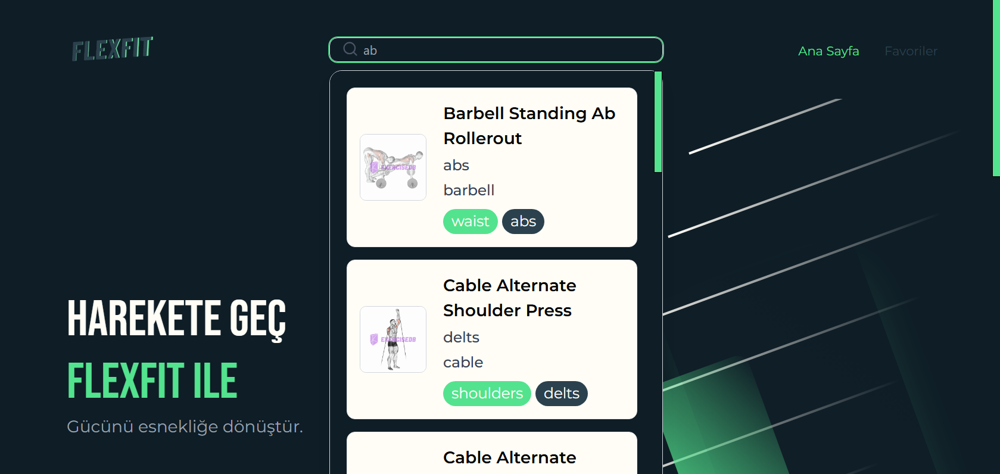
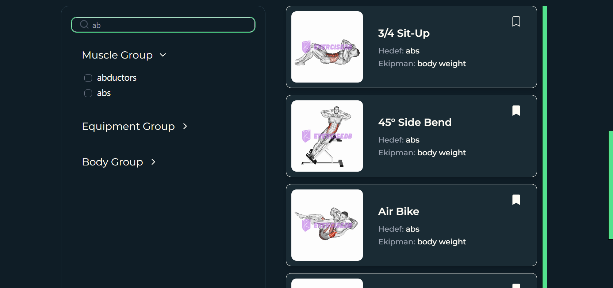
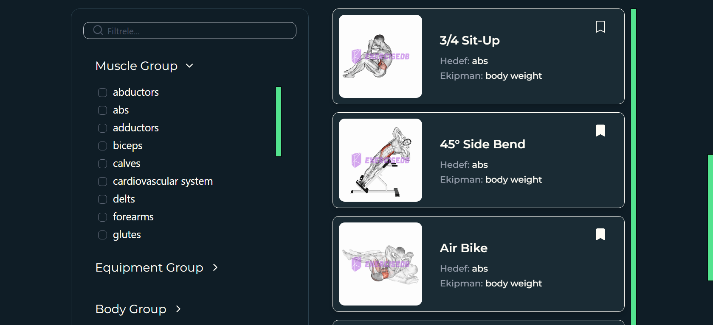

# FlexFit

**FlexFit**, kullanıcıların kas grubuna göre egzersizleri keşfedebileceği, her egzersize ait detay bilgilerin sunulduğu ve görsel destekli bir **egzersiz rehberi uygulamasıdır**. Uygulama; **Vite**, **React**, **TypeScript**, **Tailwind CSS**, **Framer Motion**, **React Query**, **Formik & Yup** gibi modern teknolojiler kullanılarak geliştirilmiştir.

---

## Proje Amacı

- Kullanıcılara kas grubuna göre filtrelenebilir egzersizleri sunmak
- Her egzersiz için isim, hedef kas grubu, ekipman bilgisi ve GIF görseli göstermek
- Arama formu ile egzersizleri kolayca bulma
- Beğenilen egzersizleri **favorilere** ekleyip `localStorage` ile saklamak
- API üzerinden veri çekimi ve önbellekleme işlemlerini verimli şekilde gerçekleştirmek

---

## Geliştirici Notları

- Uygulama genel hatlarıyla sorunsuz çalışmaktadır. API'den gelen egzersiz verileri başarıyla filtrelenmekte ve gösterilmektedir.
- İlk filtreleme sonrası egzersiz listesi bileşeninde (ExercisesList.tsx) yeniden render oluşmasını tam olarak engelleyemedim. Bu durum yalnızca ilk filtreleme etkileşiminde oluşmakta, sonraki filtrelemeler beklendiği gibi 
  çalışmaktadır.
- Bu problemi çözmek için React.memo, useMemo ve useCallback gibi optimizasyon teknikleri denendi ancak tam çözüm sağlanamadı.

---

## Kullanılan Teknolojiler & Kütüphaneler

- **React** – Modern UI bileşen mimarisi  
- **Vite** – Hızlı geliştirme ve derleme aracı  
- **Typescript** – Tip güvenliği ile daha sağlam JavaScript geliştirme  
- **Tailwind CSS** – Utility-first CSS framework  
- **Framer Motion** – Etkileyici ve pürüzsüz animasyonlar  
- **React Router DOM** – Sayfa yönlendirme ve gezinme  
- **React Icons** – Popüler ikon kütüphanesi  
- **React Toastify** – Bildirim yönetim sistemi  
- **React Helmet** – SEO ve meta etiket yönetimi  
- **TanStack Query (React Query)** – Veri fetch işlemleri ve cache yönetimi  
- **Formik & Yup** – Form yönetimi ve doğrulama  
- **React Lottie** – JSON animasyon desteği  
- **React Window** – Performanslı liste render'ı  
- **React Use** – Custom hook koleksiyonu  
- **Axios** – HTTP istekleri için istemci kütüphanesi  

---

## Projeyi Kurmak ve Çalıştırmak

```bash
1. git clone https://github.com/emirtetik/FlexFit.git
2. cd FlexFit
3. npm install
4. Ortam değişkenleri için `.env` dosyası oluşturun

# (.env içerisine API_KEY ve API_URL değişkenlerini ekleyin)
# VITE_API_URL=https://exercisedb.p.rapidapi.com/
# VITE_API_KEY=3a52c61e9bmsh08dbab9949209f6p157065jsncb6e535e9d01

5.npm run dev

```




